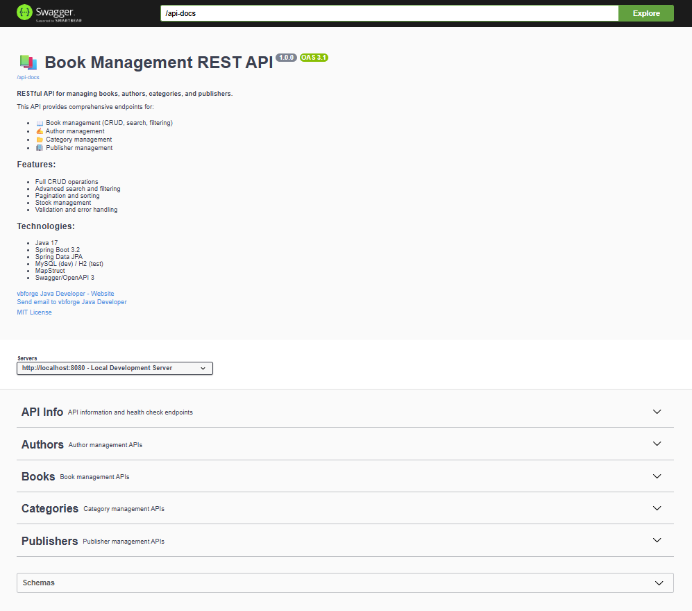

# 📚 Book Management REST API

A comprehensive RESTful API for managing books, authors, categories, and publishers built with Spring Boot 3 and Java 17.

[](https://www.oracle.com/java/)
[](https://spring.io/projects/spring-boot)
[](https://www.mysql.com/)
[](https://opensource.org/licenses/MIT)

---



---

## 🎯 Features

- ✅ **Full CRUD Operations** for Books, Authors, Categories, and Publishers
- ✅ **Advanced Search & Filtering** (by title, author, category, price range, stock)
- ✅ **Pagination & Sorting** for large datasets
- ✅ **Stock Management** with low-stock alerts
- ✅ **Input Validation** with detailed error messages
- ✅ **Global Exception Handling** with standardized error responses
- ✅ **Interactive API Documentation** with Swagger/OpenAPI
- ✅ **Comprehensive Testing** (52+ unit and integration tests)
- ✅ **Postman Collection** for easy API testing

---

## 🛠️ Technology Stack

### Backend
- **Java 17** - Programming language
- **Spring Boot 3.5.7** - Application framework
- **Spring Data JPA** - Data persistence
- **Spring Validation** - Input validation
- **Hibernate** - ORM framework

### Database
- **MySQL 8.0** - Production database
- **H2** - In-memory database for testing

### Documentation & Testing
- **Swagger/OpenAPI 3** - API documentation
- **JUnit 5** - Unit testing
- **Mockito** - Mocking framework
- **MockMvc** - Controller integration testing
- **REST Assured** - API testing

### Tools
- **Maven** - Build automation
- **Lombok** - Reduce boilerplate code
- **MapStruct** - Object mapping
- **Postman** - API testing

---

## 📋 Prerequisites

Before running this application, ensure you have:

- ☕ **Java 17** or higher
- 🗄️ **MySQL 8.0** or higher
- 🔧 **Maven 3.6+**
- 📮 **Postman** (optional, for testing)

---

## 🚀 Getting Started

### 1. Clone the Repository

```bash
git clone https://github.com/yourusername/book-management-rest-api.git
cd book-management-rest-api
```

### 2. Setup MySQL Database

Create the database using the provided schema:

```bash
mysql -u root -p < database/schema.sql
```

Load sample data (optional):

```bash
mysql -u root -p < database/data.sql
```

### 3. Configure Database Connection

Edit `src/main/resources/application.properties`:

```properties
spring.datasource.url=jdbc:mysql://localhost:3306/book_management_db?createDatabaseIfNotExist=true
spring.datasource.username=your_username
spring.datasource.password=your_password
```

### 4. Build the Project

```bash
mvn clean install
```

### 5. Run the Application

```bash
mvn spring-boot:run
```

The API will be available at: `http://localhost:8080`

---

## 📖 API Documentation

### Swagger UI (Interactive)

Once the application is running, access the interactive API documentation:

```
http://localhost:8080/swagger-ui.html
```

### OpenAPI JSON Specification

```
http://localhost:8080/api-docs
```

### API Endpoints Summary

| Resource | Endpoints | Count |
|----------|-----------|-------|
| 📚 Books | `/api/books/**` | 14 |
| 👤 Authors | `/api/authors/**` | 8 |
| 📂 Categories | `/api/categories/**` | 7 |
| 🏢 Publishers | `/api/publishers/**` | 6 |
| ℹ️ API Info | `/api/**` | 3 |
| **Total** | | **38** |

[CHECK MORE API DOCUMENTATION](documentation/API_DOCUMENTATION.md)

---

## 🧪 Testing

### Run All Tests

```bash
mvn test
```

### Run Specific Test Class

```bash
mvn test -Dtest=BookServiceImplTest
```

### Test Coverage

The project includes 52+ tests:
- ✅ 28 Service layer tests (unit tests with Mockito)
- ✅ 18 Controller tests (integration tests with MockMvc)
- ✅ 6 Exception handler tests

[CHECK API TESTING GUIDE](documentation/API_TESTING_GUIDE.md)

---

## 📮 Postman Collection

### Import Collection

1. Open Postman
2. Click **Import**
3. Select `Book-Management-API.postman_collection.json` [download](postman/Book-Management-API.postman_collection.json)
4. Import `Book-Management-API-Local.postman_environment.json` [download](postman/Book-Management-API-Local.postman_environment.json)
5. Select "Book Management API - Local" environment

### Test the API

The collection includes:
- ✅ All CRUD operations for all resources
- ✅ Pre-configured request examples
- ✅ Environment variables
- ✅ Automated tests for key endpoints

---

## 📊 Project Structure

```
book-management-rest-api/
├── src/
│   ├── main/
│   │   ├── java/com/vbforge/bookapi/
│   │   │   ├── config/              # Configuration classes
│   │   │   ├── controller/          # REST controllers
│   │   │   ├── dto/                 # Data Transfer Objects
│   │   │   ├── entity/              # JPA entities
│   │   │   ├── exception/           # Custom exceptions & handler
│   │   │   ├── mapper/              # MapStruct mappers
│   │   │   ├── repository/          # Spring Data JPA repositories
│   │   │   └── service/             # Business logic layer
│   │   └── resources/
│   │       ├── application.properties
│   │       └── application-test.properties
│   └── test/
│       └── java/com/vbforge/bookapi/  # Test classes
├── database/
│   ├── schema.sql                   # Database schema
│   └── data.sql                     # Sample data
├── postman/
│   ├── Book-Management-API.postman_collection.json
│   └── Book-Management-API-Local.postman_environment.json
├── documentation                    # api documentations provided here via .md files
├── pom.xml
└── README.md                        # main project review
```

---

## 🔧 Configuration

### Application Properties

Key configuration in `application.properties`:

```properties
# Server
server.port=8080

# Database
spring.datasource.url=jdbc:mysql://localhost:3306/book_management_db
spring.jpa.hibernate.ddl-auto=update
spring.jpa.show-sql=true

# Swagger
springdoc.api-docs.path=/api-docs
springdoc.swagger-ui.path=/swagger-ui.html
```

---

## 📝 API Usage Examples

### Create a Book

**POST** `/api/books`

```json
{
  "isbn": "978-0-123456-78-9",
  "title": "Sample Book",
  "description": "A great book",
  "publicationDate": "2024-01-15",
  "price": 29.99,
  "stockQuantity": 100,
  "language": "English",
  "pageCount": 350,
  "categoryId": 1,
  "publisherId": 1,
  "authorIds": [1]
}
```

**Response (201 Created):**

```json
{
  "success": true,
  "message": "Book created successfully",
  "data": {
    "id": 1,
    "isbn": "978-0-123456-78-9",
    "title": "Sample Book",
    "price": 29.99,
    "stockQuantity": 100
  },
  "timestamp": "2024-11-04T15:30:45"
}
```

### Get All Books (Paginated)

**GET** `/api/books?page=0&size=10&sortBy=title&direction=ASC`

```json
{
  "success": true,
  "message": "Operation completed successfully",
  "data": {
    "content": [...],
    "pageNumber": 0,
    "pageSize": 10,
    "totalElements": 50,
    "totalPages": 5,
    "first": true,
    "last": false
  },
  "timestamp": "2024-11-04T15:30:45"
}
```

### Search Books

**GET** `/api/books/search?keyword=harry`

Returns books matching the keyword in title, description, or author name.

---

## ⚠️ Error Handling

All errors follow a standardized format:

### Validation Error (400)

```json
{
  "success": false,
  "message": "Validation failed",
  "error": "Validation Error",
  "status": 400,
  "validationErrors": [
    {
      "field": "title",
      "message": "Title is required",
      "rejectedValue": null
    }
  ],
  "timestamp": "2024-11-04T15:30:45"
}
```

### Resource Not Found (404)

```json
{
  "success": false,
  "message": "Book not found with id: '999'",
  "error": "Resource Not Found",
  "status": 404,
  "path": "/api/books/999",
  "timestamp": "2024-11-04T15:30:45"
}
```

[CHECK API ERROR RESPONSE EXAMPLES](documentation/API_ERROR_RESPONSE_EXAMPLES.md)

---

## 🎨 Design Patterns Used

- **Repository Pattern** - Data access abstraction
- **Service Layer Pattern** - Business logic separation
- **DTO Pattern** - Data transfer between layers
- **Factory Pattern** - (Ready for future export features)
- **Builder Pattern** - Entity construction (via Lombok)

---

## 📈 Performance Optimizations

- ✅ **Pagination** - Efficient handling of large datasets
- ✅ **JOIN FETCH** - Avoiding N+1 query problems
- ✅ **Indexing** - Database indexes on frequently queried fields
- ✅ **Connection Pooling** - Built-in with Spring Boot

---
