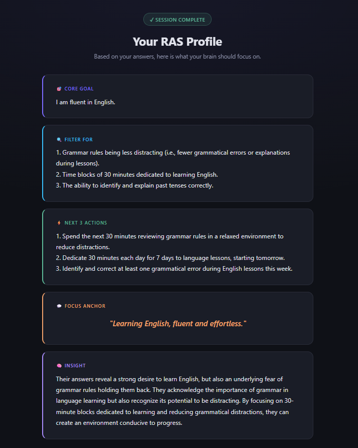
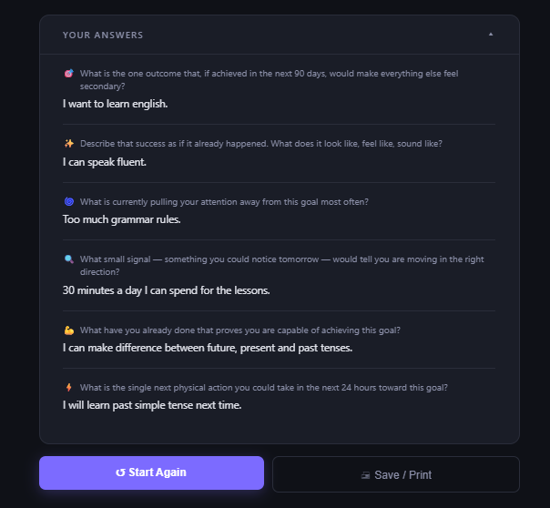

# 🧠 RAS Simulator

> A locally-running AI-powered self-reflection tool that helps you program your Reticular Activating System — the brain's attention filter.


---

## Screenshots




---

## What is RAS?

The **Reticular Activating System** is a network of nerve pathways in the brainstem that acts as your brain's filter. It decides what your conscious mind notices out of millions of incoming signals per second.

When you clearly define a goal, your RAS starts filtering your environment to surface relevant opportunities, patterns, and signals — ones that were always there, but previously ignored.

This app guides you through 6 deep reflection questions, then uses a **local AI model** to synthesize your answers into a structured RAS profile:

- 🎯 Your core goal (one clear sentence)
- 🔍 What your RAS should filter for daily
- ⚡ Your next 3 concrete actions
- 💬 A personal focus anchor phrase
- 🧠 Honest insight based on your specific answers

---

## Architecture

```
Browser (localhost:8080)
        │
        ▼
┌─────────────────────────┐
│   Spring Boot App       │  ← Thymeleaf templates
│   (port 8080)           │  ← Session management
│                         │  ← Question flow logic
└────────────┬────────────┘
             │ HTTP (WebClient)
             ▼
┌─────────────────────────┐
│   Ollama                │  ← Local LLM runtime
│   (port 11434)          │  ← llama3.2:3b model
│                         │  ← No internet required
└─────────────────────────┘

Both services run inside Docker on a shared private network.
Zero data leaves your machine.
```

---

## Quick Start

### Prerequisites
- [Docker Desktop](https://www.docker.com/products/docker-desktop/) installed and running
- ~3GB free disk space (for the AI model)
- 8GB+ RAM recommended

### Run with Docker (recommended)

```bash
# 1. Pull and start everything
docker-compose up -d

# 2. Download the AI model (first time only — ~2GB)
docker exec -it ras-ollama ollama pull llama3.2:3b

# 3. Open in browser
open http://localhost:8080
```

> **First run note:** After pulling the model, restart the app container so it can connect:
> `docker-compose restart app`

### Stop

```bash
docker-compose down
```

### Pull from DockerHub (no build required)

```bash
docker pull vladbogdadocker/ras-simulator
```

---

## How It Works

```
Welcome Page
     │
     ▼ POST /start — creates HTTP session
     │
     ▼ GET /question — serves question by index
     │
  [6 questions, one per page]
     │
     ▼ POST /answer — saves answer, advances index
     │
     ▼ GET /question → redirects to /processing when done
     │
     ▼ processing.html — spinner page, triggers /process via JS
     │
     ▼ GET /process — calls OllamaService.analyze() (blocking, up to 120s)
     │
     ▼ redirect /result
     │
     ▼ Result page — JS parses AI response into 5 styled section cards
```

**Session state** is stored server-side in Spring's `HttpSession`. The browser holds only a session cookie. No database required.

**The AI prompt** is constructed from all 6 question-answer pairs and instructs Ollama to return exactly 5 structured sections with emoji headers. The JavaScript parser on the result page splits the response into individual cards.

---

## Project Structure

```
ras-simulator/
├── src/main/
│   ├── java/com/vbforge/ras/
│   │   ├── RasApplication.java          # Entry point
│   │   ├── controller/
│   │   │   └── RasController.java       # All routing + session flow
│   │   ├── service/
│   │   │   ├── QuestionService.java     # Loads questions.json at startup
│   │   │   └── OllamaService.java       # Prompt builder + Ollama HTTP client
│   │   └── model/
│   │       ├── Question.java            # Question DTO
│   │       └── SessionData.java         # Per-user session state
│   └── resources/
│       ├── application.yml              # App config
│       ├── questions.json               # Default question bank (editable)
│       └── templates/
│           ├── index.html               # Welcome page
│           ├── question.html            # Question flow
│           ├── processing.html          # AI loading screen
│           └── result.html              # RAS profile results
├── Dockerfile                           # Multi-stage build
├── docker-compose.yml                   # App + Ollama services
├── DOCKERHUB_PUSH.md                    # Instruction for dockerization 
└── README.md
```

---

## Configuration

All config lives in `src/main/resources/application.yml`:

| Property | Default | Description |
|---|---|---|
| `ras.ollama.base-url` | `http://localhost:11434` | Ollama URL (overridden in Docker) |
| `ras.ollama.model` | `llama3.2:3b` | Model to use |
| `ras.ollama.timeout` | `120` | Max seconds to wait for AI response |
| `ras.questions.file` | `classpath:questions.json` | Question bank location |

### Changing the AI model

Edit `application.yml` and pull the new model:

```bash
# Lighter (faster, less accurate)
docker exec -it ras-ollama ollama pull phi4-mini

# Heavier (slower, more accurate) — needs 8GB+ RAM
docker exec -it ras-ollama ollama pull llama3.1:8b
```

### Customising questions

Edit `src/main/resources/questions.json`. Each question follows this structure:

```json
{
  "id": 7,
  "text": "Your question here?",
  "hint": "A helpful hint for the user.",
  "icon": "🌟"
}
```

No code changes needed — questions are loaded at startup.

---

## Development

### Run locally (IntelliJ)

```bash
# Start Ollama only
docker-compose up ollama -d

# Run RasApplication.java from IntelliJ
# App connects to localhost:11434 by default
```

### Build Docker image manually

```bash
docker build -t vladbogdadocker/ras-simulator .
```

### Tech stack

| Layer | Technology |
|---|---|
| Language | Java 21 |
| Framework | Spring Boot 3.3 |
| Templates | Thymeleaf |
| HTTP Client | WebFlux WebClient |
| AI Runtime | Ollama |
| AI Model | llama3.2:3b |
| Containerisation | Docker + Compose |

---

## Author

- [@vbforge](https://github.com/vbforge)

---

## License

MIT — do whatever you want with it.


